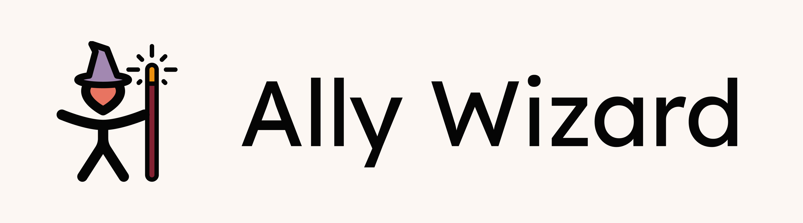
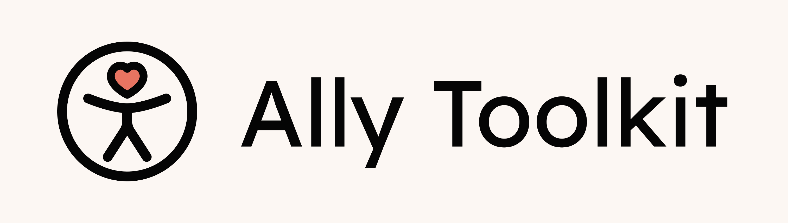

# Ally Wizard

<picture>
  <source media="(prefers-color-scheme: dark)" srcset="assets/ally-wizard-banner-dark.png">
  <source media="(prefers-color-scheme: light)" srcset="assets/ally-wizard-banner-light.png">
  
</picture>

Tired of promising yourself you’ll “fix accessibility later”?
This little CLI helps you add accessibility testing, linting, and CI/CD to your existing React app right now - no pain, no excuses.

## Quick Start

```bash
npx ally-wizard
```

Run it inside your React project. Answer a few questions. Get accessibility superpowers. Done!

## What You Can Add

### Testing Tools

- **Axe** - quick checks for common a11y issues
- **Pa11y** - detailed reports you can actually understand
- **Lighthouse** - accessibility scores and audits

### Coding Helpers

- **ESLint accessibility plugin** - catches mistakes while you write

### Automation

- **GitHub Actions** - run a11y tests on every push, no manual effort

## Why Bother?

Because accessibility isn't an optional extra - it makes the web better for everyone:

- ✅ More people can use and enjoy your app
- ✅ Good a11y = better overall UX
- ✅ Many regions legally require it

## Tips & Troubleshooting

- Your React app should be running on `localhost:3000` before testing
- Needs Node.js installed
- Works with npm, yarn, or pnpm (auto-detected)

---

<picture>

  <source media="(prefers-color-scheme: dark)" srcset="assets/ally-toolkit-banner-dark.png">
  <source media="(prefers-color-scheme: light)" srcset="assets/ally-toolkit-banner-light.png">
  
</picture>

Part of **Ally Toolkit** · _Built with a focus on accessibility 🩷_
