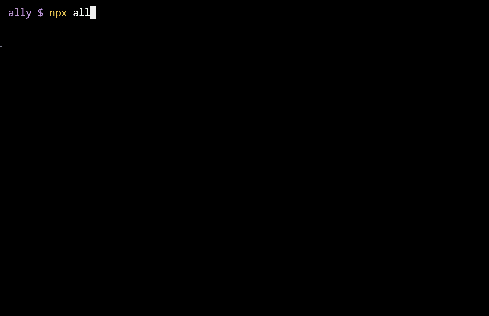

# Ally Wizard

<picture>
  <source media="(prefers-color-scheme: dark)" srcset="assets/ally-wizard-banner-dark.png">
  <source media="(prefers-color-scheme: light)" srcset="assets/ally-wizard-banner-light.png">
  
</picture>

Worried about putting off those key accessibility upgrades? This CLI makes it super easy to add accessibility testing, linting, and CI/CD to your React app right now, helping you make a real impact without spending a ton of time on it!

## Quick Start

```bash
npx ally-wizard
```

Run it inside your React project. Answer a few questions. Done!



## What You Can Add

### Testing Tools

- **Axe** - quick checks for common a11y issues
- **Pa11y** - detailed reports you can actually understand
- **Lighthouse** - accessibility scores and audits

### Coding Helpers

- **ESLint accessibility plugin** - catches mistakes while you write

### Automation

- **GitHub Actions** - run a11y tests on every push, no manual effort

## Why Bother?

Because accessibility isn't an optional extra - it makes the web better for everyone:

- More people can use and enjoy your app
- Good a11y = better overall UX
- Many regions legally require it

## Tips & Troubleshooting

- Your React app should be running on `localhost:3000` before testing (`vite --port 3000`)
- Needs Node.js installed

---

<picture>

  <source media="(prefers-color-scheme: dark)" srcset="assets/ally-toolkit-banner-dark.png">
  <source media="(prefers-color-scheme: light)" srcset="assets/ally-toolkit-banner-light.png">
  
</picture>

Part of **Ally Toolkit** · _Built with a focus on accessibility 🩷_
